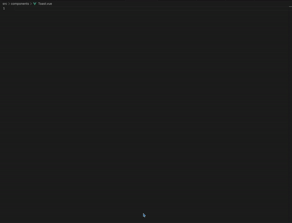

# Vuejs Snippets

## Description

Short and simple vue snippets!

**This project still needs support for nuxt, vite config, vue 2, vue router, and pinia.**

- Contributions are welcome [github](https://github.com/devloos/vuejs-snippets)
- If you're submitting a code snippet, it's essential to include corresponding documentation within the tables in the README. Please note that we won't be able to accept your pull request without this documentation. Thank you for your understanding!

## Installation

- Go here [vscode extensions marketplace](https://marketplace.visualstudio.com/items?itemName=devlos.vuejs-snippets)

### Vue

| Snippet       | Purpose                                                |
| ------------- | ------------------------------------------------------ |
| `vueinit`     | Single file component with script, template, and style |
| `vuescript`   | vue script tag                                         |
| `vuetemplate` | vue template tag                                       |
| `vuestyle`    | vue style tag                                          |

### Script

| Snippet             | Purpose                       |
| ------------------- | ----------------------------- |
| `vuecomputed`       | computed property             |
| `vuewatch`          | watcher                       |
| `vueonmounted`      | mounted lifecycle method      |
| `vueonbeforemount`  | beforeMount lifecycle method  |
| `vueonbeforeupdate` | beforeUpdate lifecycle method |
| `vueonupdated`      | updated lifecycle method      |
| `vueonactivated`    | keepalive lifecycle method    |
| `vueondeactivated`  | keepalive lifecycle method    |

### Template

| Snippet   | Purpose                           |
| --------- | --------------------------------- |
| `vfor`    | v-for directive                   |
| `vmodel`  | Semantic v-model directive        |
| `von`     | v-on click handler with arguments |
| `vhtml`   | inserting html                    |
| `vshow`   | setting element to display one    |
| `vif`     | removing or adding element to dom |
| `velseif` | use along side v-if               |
| `vtext`   | v-text                            |
| `vbind`   | binding onto attributes           |
| `vpre`    | v-pre                             |
| `vcloak`  | v-cloak                           |
| `vonce`   | evaluate only once                |
| `vkey`    | key                               |
| `vref`    | reference to a dom element        |

**Enjoy!**
